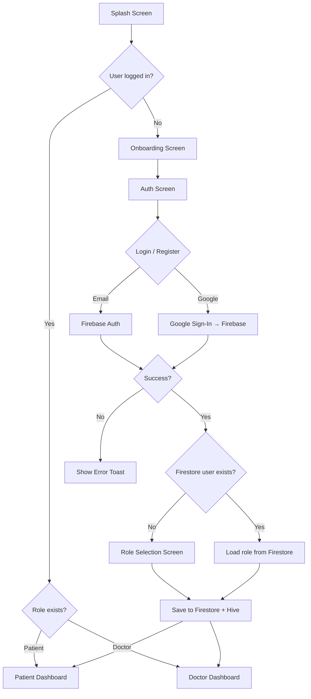
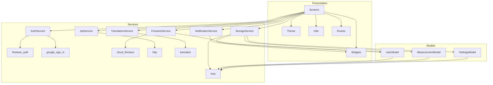

# NABDA — Architecture & Structure Report

> **Date:** February 16, 2026  
> **Version:** 0.1.0  
> **Flutter SDK:** ^3.7.0 (running 3.41.1 stable)  
> **Firebase Project:** `gp-app-c24de`

---

## 1. Executive Summary

**NABDA** is a cross-platform Flutter mobile application designed for real-time health monitoring and patient-doctor communication. It supports two distinct user roles — **Patient** and **Doctor** — each with dedicated dashboards and feature sets. The app uses **Firebase** for authentication and cloud data storage, **Hive** for local persistence, and a custom localization system supporting **English and Arabic**.

---

## 2. High-Level Architecture

```
┌──────────────────────────────────────────────────────────┐
│                     Presentation Layer                    │
│  ┌──────────┐  ┌──────────┐  ┌──────────┐  ┌──────────┐ │
│  │ Screens  │  │ Widgets  │  │  Theme   │  │  Routes  │ │
│  │ (9 dirs) │  │(16 + 3)  │  │          │  │          │ │
│  └────┬─────┘  └────┬─────┘  └────┬─────┘  └────┬─────┘ │
├───────┼──────────────┼────────────┼────────────┼─────────┤
│       │         Service Layer     │            │          │
│  ┌────┴──────────────┴────────────┴────────────┴───────┐ │
│  │  AuthService │ FirestoreService │ StorageService     │ │
│  │  ApiService  │ NotificationSvc  │ TranslationSvc     │ │
│  └──────┬───────────────┬──────────────────┬───────────┘ │
├─────────┼───────────────┼──────────────────┼─────────────┤
│         │          Data Layer              │              │
│  ┌──────┴───────────────┴──────────────────┴───────────┐ │
│  │  UserModel  │  MeasurementModel  │  SettingsModel   │ │
│  │  (Hive TypeAdapters — manual, no code generation)   │ │
│  └─────────────────────────────────────────────────────┘ │
├──────────────────────────────────────────────────────────┤
│                   External Services                       │
│  ┌─────────────┐  ┌──────────────┐  ┌──────────────────┐ │
│  │ Firebase     │  │ Google       │  │ Spring Boot      │ │
│  │ Auth +       │  │ Sign-In      │  │ Backend API      │ │
│  │ Firestore    │  │              │  │ (port 8080)      │ │
│  └─────────────┘  └──────────────┘  └──────────────────┘ │
└──────────────────────────────────────────────────────────┘
```

### Architectural Pattern

The app follows a **feature-based folder structure** with a **service-oriented** approach. There is no formal state management library (e.g., BLoC, Provider, Riverpod). State is managed through:

- **`StatefulWidget` + `setState()`** — all screens use manual state management
- **`ValueListenableBuilder<Box>`** — the root `MaterialApp` reactively rebuilds when Hive settings change (language, theme)
- **Static service classes** — all services use `static` methods (singleton-like pattern without dependency injection)

---

## 3. Directory Structure

```
lib/
├── main.dart                          # App entry point, Firebase init, Hive init
├── firebase_options.dart              # FlutterFire CLI generated config
│
├── core/
│   └── config/
│       └── api_config.dart            # Backend API base URL (http://10.0.2.2:8080/api)
│
├── models/                            # Data models with manual Hive TypeAdapters
│   ├── user_model.dart                # UserModel (typeId: 0) — id, fullName, email, role, licenseNumber
│   ├── measurement_model.dart         # MeasurementModel (typeId: 1) — type, value, unit, timestamp
│   └── settings_model.dart            # SettingsModel (typeId: 2) — isDarkMode, enableNotifications, languageCode
│
├── services/                          # Business logic layer (all static methods)
│   ├── auth_service.dart              # Firebase Auth: email/password + Google Sign-In
│   ├── firestore_service.dart         # Cloud Firestore CRUD for user profiles
│   ├── storage_service.dart           # Hive local storage: users, measurements, settings
│   ├── api_service.dart               # HTTP client for Spring Boot backend
│   ├── notification_service.dart      # In-app toast notifications via Overlay
│   └── translation_service.dart       # Google Translate API via 'translator' package
│
├── routes/
│   ├── app_routes.dart                # Named route definitions + onGenerateRoute
│   └── app_page_route.dart            # Custom page transitions (fade+slide, scale+fade)
│
├── screens/                           # Feature-based screen organization
│   ├── splash/
│   │   └── splash_screen.dart
│   ├── onboarding/
│   │   └── onboarding_screen.dart
│   ├── auth/
│   │   └── auth_screen.dart           # Login + Register + Google SSO + Role selection (842 lines)
│   ├── role_selection/
│   │   └── role_selection_screen.dart
│   ├── patient/                       # Patient-specific screens
│   │   ├── patient_dashboard_screen.dart   # Main patient dashboard (422 lines)
│   │   ├── chatbot_screen.dart             # AI health assistant chat (224 lines)
│   │   ├── doctor_chat_screen.dart         # Patient → Doctor messaging
│   │   ├── follow_ups_screen.dart          # Follow-up appointments
│   │   ├── medical_history_screen.dart     # 4-tab medical records (616 lines)
│   │   └── vitals_history_screen.dart      # Vitals tracking history
│   ├── doctor/                        # Doctor-specific screens
│   │   ├── doctor_dashboard_screen.dart    # Main doctor dashboard (600 lines)
│   │   ├── patient_detail_screen.dart      # Detailed patient view
│   │   └── patient_chat_screen.dart        # Doctor → Patient messaging
│   ├── profile/
│   │   └── profile_screen.dart
│   ├── settings/
│   │   └── settings_screen.dart
│   └── notifications/
│       └── notifications_screen.dart
│
├── theme/
│   └── app_theme.dart                 # Light theme only (dark theme removed)
│
├── utils/
│   ├── constants.dart                 # AppColors, AppStrings, AppAssets, AppDimensions
│   └── app_localizations.dart         # Custom LocalizationsDelegate with 300+ keys (EN + AR)
│
└── widgets/
    ├── animations/                    # Reusable animation wrappers
    │   ├── animated_list_item.dart    # Staggered list entry animation
    │   ├── fade_slide_transition.dart # Fade + vertical slide
    │   └── scale_on_tap.dart          # Press-and-scale interaction effect
    └── reusable/                      # Shared UI components
        ├── alert_card.dart
        ├── animated_toast.dart        # Custom toast notification widget
        ├── app_logo.dart
        ├── custom_bottom_nav.dart     # Role-aware bottom navigation bar
        ├── custom_button.dart
        ├── custom_card.dart
        ├── decorated_background.dart  # Background decoration wrapper
        ├── logout_dialog.dart
        ├── patient_card.dart          # Doctor's patient list item
        ├── section_title.dart
        ├── stat_card.dart             # Statistics display card
        ├── status_card.dart           # Health status display
        └── vital_card.dart            # Vital signs display card
```

---

## 4. Technology Stack

| Category           | Technology                         | Version        | Purpose                                     |
| ------------------ | ---------------------------------- | -------------- | ------------------------------------------- |
| **Framework**      | Flutter                            | 3.41.1         | Cross-platform UI                            |
| **Language**        | Dart                               | SDK ^3.7.0     | Application logic                            |
| **Auth**           | `firebase_auth`                    | ^5.3.4         | Email/password + Google Sign-In              |
| **Database (Cloud)**| `cloud_firestore`                 | ^5.4.4         | User profiles in Firestore                   |
| **Database (Local)**| `hive` + `hive_flutter`           | ^2.2.3         | Offline-first local storage                  |
| **Google SSO**     | `google_sign_in`                   | ^6.2.2         | OAuth 2.0 Google authentication              |
| **HTTP Client**    | `http`                             | ^1.6.0         | REST API calls to Spring Boot backend        |
| **Translation**    | `translator`                       | ^1.0.0         | Google Translate API for runtime translation |
| **Internationalization** | `flutter_localizations` + `intl` | SDK + ^0.20.0 | EN/AR localization                         |
| **Icons**          | `font_awesome_flutter`             | ^10.6.0        | Extended icon set                            |
| **Linting**        | `flutter_lints`                    | ^5.0.0         | Code quality                                 |

---

## 5. Data Flow & Architecture Details

### 5.1 Authentication Flow



**Key details:**

- `AuthService` wraps `FirebaseAuth` — static methods for `signInWithEmail()`, `registerWithEmail()`, `signInWithGoogle()`, `signOut()`
- On successful auth, `_handleAuthSuccess()` in `AuthScreen` checks `FirestoreService.userExists()` to determine if the user is new
- New users are sent to `RoleSelectionScreen` to choose Patient/Doctor
- The `UserModel` (with role) is saved to both **Firestore** (cloud) and **Hive** (local)

### 5.2 Data Persistence Strategy

| Data | Storage | Sync Strategy | Purpose |
|------|---------|---------------|---------|
| User profile | Hive (`userBox`) + Firestore (`users` collection) | Write-through (Firestore first, then Hive) | Auth state + role |
| Vitals/Measurements | Hive (`measurementsBox`) | Local only | Heart rate, SpO2, etc. |
| App settings | Hive (`settingsBox`) | Local only | Language, notifications, dark mode |

**Hive TypeAdapters** are written **manually** (no `build_runner` / `hive_generator`). Each model has a custom `TypeAdapter` with explicit `typeId`:

- `UserModel` → typeId `0`
- `MeasurementModel` → typeId `1`
- `SettingsModel` → typeId `2`

### 5.3 Navigation Architecture

| Property | Value |
|----------|-------|
| Strategy | Named routes with `onGenerateRoute` |
| Total routes | 15 named routes |
| Transition | Custom `AppPageRoute` (fade + slide from right, 350ms) |
| Modal transition | `AppScaleRoute` (scale + fade, 300ms) |
| Navigator key | Global key held by `NotificationService` for overlay access |

**Route Map:**

| Route | Screen | Role |
|-------|--------|------|
| `/` | SplashScreen | All |
| `/onboarding` | OnboardingScreen | All |
| `/auth` | AuthScreen | All |
| `/role_selection` | RoleSelectionScreen | All |
| `/patient_dashboard` | PatientDashboardScreen | Patient |
| `/chatbot` | ChatbotScreen | Patient |
| `/doctor_chat` | DoctorChatScreen | Patient |
| `/follow_ups` | FollowUpsScreen | Patient |
| `/medical_history` | MedicalHistoryScreen | Patient |
| `/doctor_dashboard` | DoctorDashboardScreen | Doctor |
| `/patient_detail` | PatientDetailScreen | Doctor |
| `/patient_chat` | PatientChatScreen | Doctor |
| `/profile` | ProfileScreen | All |
| `/settings` | SettingsScreen | All |
| `/notifications` | NotificationsScreen | All |

### 5.4 Localization System

The app uses a **custom `AppLocalizations` class** with a `LocalizationsDelegate`:

1. **Static dictionaries**: 300+ hardcoded key-value pairs for English and Arabic
2. **Runtime translation fallback**: If a key is missing, calls `TranslationService` (Google Translate API via `translator` package) to translate on-the-fly
3. **Reactive locale switching**: The root `MaterialApp` is wrapped in a `ValueListenableBuilder` on the Hive settings box, so changing the language code triggers a full rebuild

**Supported locales:** `en`, `ar`

### 5.5 Backend Integration (Spring Boot)

- **Config**: `ApiConfig.baseUrl = 'http://10.0.2.2:8080/api'` (Android emulator loopback)
- **Current state**: `ApiService` has only a `testConnection()` method — backend integration is **in early stages**
- **Backend stack** (from related conversations): Spring Boot with PostgreSQL on AWS RDS

---

## 6. Design System

### 6.1 Color Palette

| Token | Hex | Usage |
|-------|-----|-------|
| `primaryBlue` | `#407BFF` | Primary actions, buttons, accents |
| `secondaryBlue` | `#00B4D8` | Secondary highlights |
| `darkBlue` | `#03045E` | Headings, text |
| `accentTeal` | `#00BFA5` | ColorScheme secondary |
| `background` | `#F8FAFC` | Scaffold background |
| `grey` | `#94A3B8` | Body text |
| `lightGrey` | `#E2E8F0` | Borders, dividers |
| `error` | `#E53935` | Error states |
| `gradientStart → gradientEnd` | `#407BFF → #00B4D8` | Primary gradient |

### 6.2 Spacing & Radius Tokens

| Token | Value |
|-------|-------|
| `paddingS` | 8px |
| `paddingM` | 16px |
| `paddingL` | 24px |
| `paddingXL` | 32px |
| `radiusS` | 8px |
| `radiusM` | 16px |
| `radiusL` | 24px |
| `radiusXL` | 30px |

### 6.3 Theme

- **Light theme only** (dark theme stub exists but is removed)
- Font family: `Roboto`
- Elevation: 0 on AppBar
- Buttons: Rounded with `radiusM` corners

---

## 7. Widget Catalog (19 reusable components)

### Animation Widgets (3)

| Widget | Purpose |
|--------|---------|
| `AnimatedListItem` | Staggered fade+slide entry for list items |
| `FadeSlideTransition` | Configurable fade + vertical slide wrapper |
| `ScaleOnTap` | Press interaction with scale animation |

### Reusable UI Widgets (13)

| Widget | Purpose |
|--------|---------|
| `AlertCard` | Warning/info alert display |
| `AnimatedToast` | Overlay-based toast notifications (success/error/warning/info) |
| `AppLogo` | Branding logo component |
| `CustomBottomNav` | Role-aware bottom navigation bar |
| `CustomButton` | Styled action button |
| `CustomCard` | Base card component with shadow |
| `DecoratedBackground` | Background decoration wrapper for screens |
| `LogoutDialog` | Confirmation dialog for sign-out |
| `PatientCard` | Patient list item (for doctor views) |
| `SectionTitle` | Section heading component |
| `StatCard` | Statistics/metrics display |
| `StatusCard` | Health status indicator |
| `VitalCard` | Vital signs data card |

---

## 8. Role-Based Feature Matrix

| Feature | Patient | Doctor |
|---------|:-------:|:------:|
| Dashboard | ✅ | ✅ |
| Vital Signs Monitoring | ✅ | ✅ (via patient detail) |
| Medical History | ✅ | ✅ (via patient detail) |
| AI Chatbot | ✅ | ❌ |
| Doctor Chat | ✅ (send) | ✅ (receive & respond) |
| Patient List | ❌ | ✅ |
| Patient Detail View | ❌ | ✅ |
| Follow-up Appointments | ✅ | ❌ |
| Profile Management | ✅ | ✅ |
| Settings (Language, Notifications) | ✅ | ✅ |

---

## 9. Key Observations & Technical Notes

### Strengths

1. **Clean folder structure** — feature-based organization makes navigation intuitive
2. **Consistent design system** — centralized colors, spacing, and typography tokens
3. **Bilingual support** — comprehensive EN/AR localization with 300+ keys
4. **Custom animations** — smooth page transitions and interactive micro-animations
5. **Offline-capable** — Hive provides local data persistence
6. **Multi-platform Firebase config** — Android, iOS, Web, macOS, and Windows

### Areas for Future Improvement

1. **No state management library** — all screens use `setState()`. Consider adopting **Provider**, **Riverpod**, or **BLoC** as the app scales
2. **Static service singletons** — all services use `static` methods, making them hard to test or mock. Dependency injection (e.g., via `get_it`) would improve testability
3. **Large screen files** — `auth_screen.dart` (842 lines) and `doctor_dashboard_screen.dart` (600 lines) could be decomposed into smaller widgets
4. **Backend integration is minimal** — `ApiService` only has a `testConnection()` stub. The Spring Boot integration needs full CRUD endpoints
5. **No unit or widget tests** — only `flutter_test` dev dependency exists, no test files are present
6. **Dark mode not implemented** — `isDarkMode` exists in `SettingsModel` but the `AppTheme.darkTheme` has been removed
7. **Hardcoded mock data** — screens like medical history and doctor dashboard use inline mock data
8. **No image assets** — `AppAssets` references paths like `assets/images/logo.png` but no asset files or `pubspec.yaml` asset declarations exist
9. **API config uses emulator address** — `http://10.0.2.2:8080` only works on Android emulator; needs environment-based config for real devices

---

## 10. Codebase Metrics

| Metric | Value |
|--------|-------|
| Total Dart files | ~40 |
| Total lines of code (estimated) | ~5,500 |
| Number of screens | 15 |
| Number of services | 6 |
| Number of data models | 3 |
| Number of reusable widgets | 16 |
| Number of animation widgets | 3 |
| Dependencies (runtime) | 10 |
| Dependencies (dev) | 2 |
| Supported platforms | Android, iOS, Web, Windows, macOS |
| Localization keys | 300+ (English + Arabic) |
| Firebase features used | Auth, Firestore |

---

## 11. Dependency Graph



---

*Report generated from source code analysis on February 16, 2026.*
