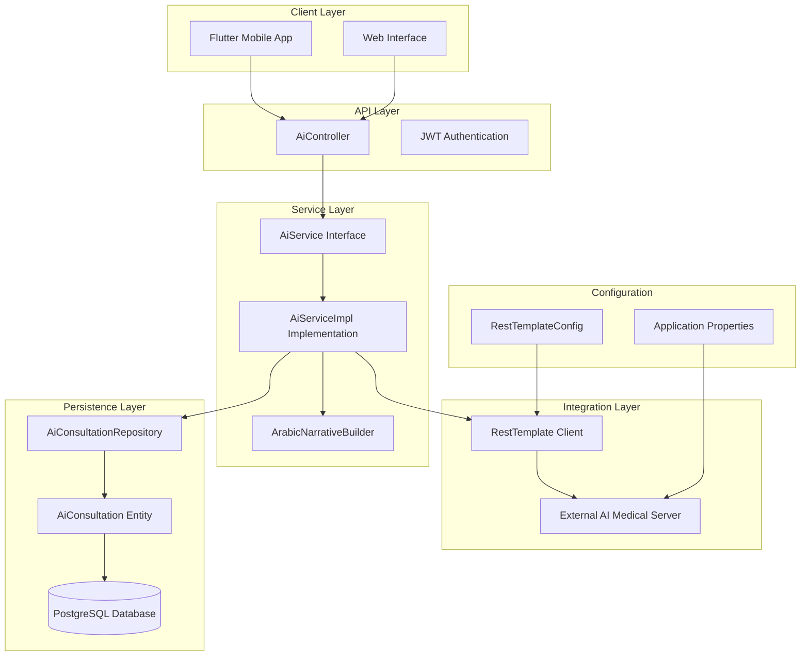
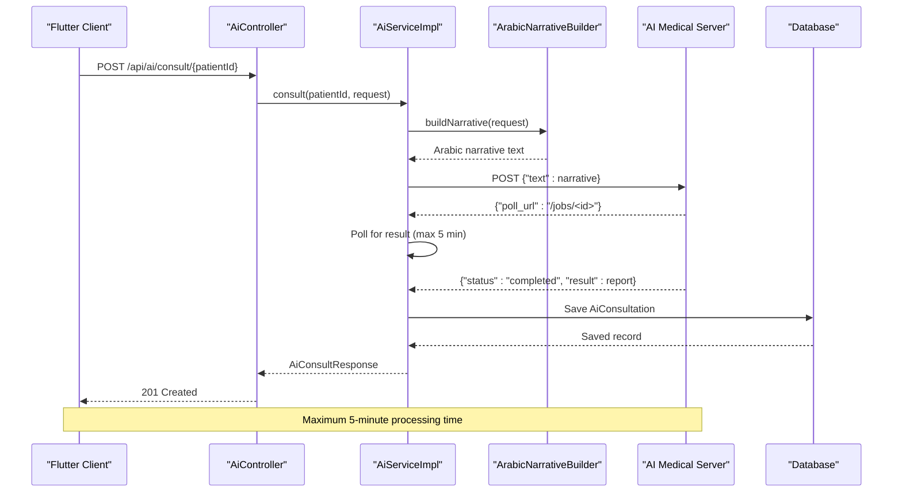
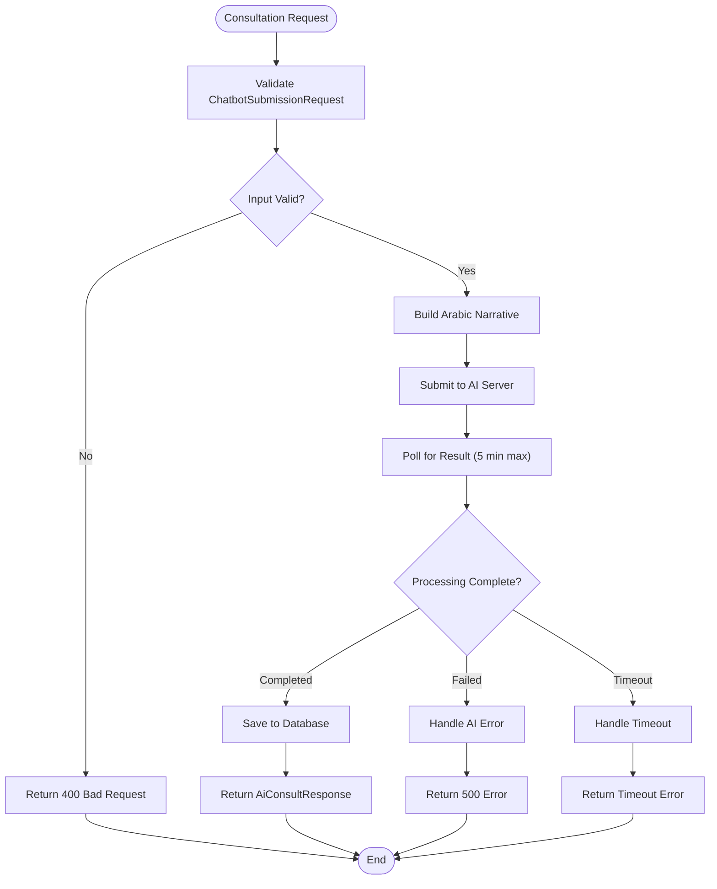

# AI Chatbot Consultation API

<cite>
**Referenced Files in This Document**
- [AiController.java](file://src/main/java/com/example/graduation_project/controller/AiController.java)
- [AiService.java](file://src/main/java/com/example/graduation_project/service/AiService.java)
- [AiServiceImpl.java](file://src/main/java/com/example/graduation_project/service/impl/AiServiceImpl.java)
- [ArabicNarrativeBuilder.java](file://src/main/java/com/example/graduation_project/service/ArabicNarrativeBuilder.java)
- [ChatbotSubmissionRequest.java](file://src/main/java/com/example/graduation_project/dto/ChatbotSubmissionRequest.java)
- [AiConsultRequest.java](file://src/main/java/com/example/graduation_project/dto/AiConsultRequest.java)
- [AiConsultResponse.java](file://src/main/java/com/example/graduation_project/dto/AiConsultResponse.java)
- [AiConsultation.java](file://src/main/java/com/example/graduation_project/entity/AiConsultation.java)
- [AiConsultationRepository.java](file://src/main/java/com/example/graduation_project/repository/AiConsultationRepository.java)
- [AiConsultationMapper.java](file://src/main/java/com/example/graduation_project/mapper/AiConsultationMapper.java)
- [RestTemplateConfig.java](file://src/main/java/com/example/graduation_project/config/RestTemplateConfig.java)
- [application-prod.properties](file://src/main/resources/application-prod.properties)
- [AI_CHATBOT_CONSULTATION_API.md](file://Plan_and_implementations/AI_CHATBOT_CONSULTATION_API.md)
- [README.md](file://README.md)
</cite>

## Table of Contents
1. [Introduction](#introduction)
2. [System Architecture](#system-architecture)
3. [Core Components](#core-components)
4. [API Endpoints](#api-endpoints)
5. [Data Flow Analysis](#data-flow-analysis)
6. [Error Handling](#error-handling)
7. [Configuration Management](#configuration-management)
8. [Security Implementation](#security-implementation)
9. [Performance Considerations](#performance-considerations)
10. [Testing and Validation](#testing-and-validation)
11. [Deployment Considerations](#deployment-considerations)
12. [Troubleshooting Guide](#troubleshooting-guide)
13. [Conclusion](#conclusion)

## Introduction

The AI Chatbot Consultation API is a sophisticated healthcare integration system that bridges a Flutter-based chatbot interface with an external AI medical report generation service. This system enables patients to undergo comprehensive medical consultations through an intuitive conversational interface, with the collected information being transformed into Arabic narratives and processed by an AI medical reporting engine.

The system serves as a critical component of the Intelligent Diagnostic Support System, providing automated medical consultation capabilities while maintaining strict security protocols and comprehensive error handling mechanisms. It supports both patient self-assessment and doctor-patient consultation workflows, integrating seamlessly with the broader healthcare management platform.

## System Architecture

The AI Chatbot Consultation API follows a layered architecture pattern with clear separation of concerns:



**Diagram sources**
- [AiController.java:24-56](file://src/main/java/com/example/graduation_project/controller/AiController.java#L24-L56)
- [AiServiceImpl.java:31-34](file://src/main/java/com/example/graduation_project/service/impl/AiServiceImpl.java#L31-L34)
- [RestTemplateConfig.java:8-18](file://src/main/java/com/example/graduation_project/config/RestTemplateConfig.java#L8-L18)

The architecture demonstrates clear separation between presentation, business logic, data persistence, and external service integration, enabling maintainability and scalability.

**Section sources**
- [AiController.java:24-56](file://src/main/java/com/example/graduation_project/controller/AiController.java#L24-L56)
- [AiServiceImpl.java:31-34](file://src/main/java/com/example/graduation_project/service/impl/AiServiceImpl.java#L31-L34)
- [RestTemplateConfig.java:8-18](file://src/main/java/com/example/graduation_project/config/RestTemplateConfig.java#L8-L18)

## Core Components

### Controller Layer

The [`AiController`:24-56](file://src/main/java/com/example/graduation_project/controller/AiController.java#L24-L56) serves as the primary entry point for AI consultation functionality, implementing three key endpoints:

- **POST /api/ai/consult/{patientId}**: Processes chatbot submissions and generates AI medical reports
- **GET /api/ai/my-reports**: Retrieves personal consultation history for patients
- **GET /api/ai/history/{patientId}**: Provides doctor-accessible consultation history

The controller enforces role-based access control, ensuring only authorized users can access sensitive medical information.

### Service Layer

The [`AiServiceImpl`:31-339](file://src/main/java/com/example/graduation_project/service/impl/AiServiceImpl.java#L31-L339) implements the core business logic with two distinct consultation methods:

1. **Legacy chat method**: Supports traditional text-based consultations
2. **New chatbot-driven method**: Processes structured chatbot JSON submissions

The service coordinates between narrative building, external AI integration, and data persistence.

### Data Transformation Layer

The [`ArabicNarrativeBuilder`:21-563](file://src/main/java/com/example/graduation_project/service/ArabicNarrativeBuilder.java#L21-L563) performs the critical translation from structured chatbot data to Arabic medical narratives, maintaining compatibility with the original Python implementation.

**Section sources**
- [AiController.java:24-56](file://src/main/java/com/example/graduation_project/controller/AiController.java#L24-L56)
- [AiServiceImpl.java:31-339](file://src/main/java/com/example/graduation_project/service/impl/AiServiceImpl.java#L31-L339)
- [ArabicNarrativeBuilder.java:21-563](file://src/main/java/com/example/graduation_project/service/ArabicNarrativeBuilder.java#L21-L563)

## API Endpoints

### Primary Endpoints

The system provides three main endpoints for AI consultation functionality:

#### 1. Submit Chatbot Assessment
**Endpoint**: `POST /api/ai/consult/{patientId}`
**Access**: `PATIENT` or `DOCTOR`
**Description**: Processes structured chatbot JSON and generates AI medical report

#### 2. Patient Self-Service
**Endpoint**: `GET /api/ai/my-reports`
**Access**: `PATIENT` only
**Description**: Retrieves the authenticated patient's consultation history

#### 3. Doctor Access
**Endpoint**: `GET /api/ai/history/{patientId}`
**Access**: `DOCTOR` only
**Description**: Allows doctors to view patient consultation history

### Request/Response Specifications

The [`ChatbotSubmissionRequest`:10-53](file://src/main/java/com/example/graduation_project/dto/ChatbotSubmissionRequest.java#L10-L53) DTO defines the comprehensive data structure for chatbot assessments, supporting:

- **Demographics**: Age, sex, weight, height, pregnancy status
- **Medical History**: Cardiac conditions, prior workups, chronic conditions
- **Medication History**: Current medications and adherence
- **Symptom Details**: Comprehensive symptom descriptions with severity and duration
- **Additional Information**: Free-text comments and red flag indicators

**Section sources**
- [AiController.java:33-55](file://src/main/java/com/example/graduation_project/controller/AiController.java#L33-L55)
- [ChatbotSubmissionRequest.java:10-53](file://src/main/java/com/example/graduation_project/dto/ChatbotSubmissionRequest.java#L10-L53)

## Data Flow Analysis

### Chatbot-to-AI Processing Pipeline



**Diagram sources**
- [AiController.java:33-40](file://src/main/java/com/example/graduation_project/controller/AiController.java#L33-L40)
- [AiServiceImpl.java:192-337](file://src/main/java/com/example/graduation_project/service/impl/AiServiceImpl.java#L192-L337)
- [ArabicNarrativeBuilder.java:266-561](file://src/main/java/com/example/graduation_project/service/ArabicNarrativeBuilder.java#L266-L561)

### Data Persistence Flow



**Diagram sources**
- [AiServiceImpl.java:192-337](file://src/main/java/com/example/graduation_project/service/impl/AiServiceImpl.java#L192-L337)
- [AiConsultationRepository.java:11-14](file://src/main/java/com/example/graduation_project/repository/AiConsultationRepository.java#L11-L14)

**Section sources**
- [AiServiceImpl.java:192-337](file://src/main/java/com/example/graduation_project/service/impl/AiServiceImpl.java#L192-L337)
- [AiConsultationRepository.java:11-14](file://src/main/java/com/example/graduation_project/repository/AiConsultationRepository.java#L11-L14)

## Error Handling

The system implements comprehensive error handling across multiple layers:

### External Service Errors
- **Connection Failures**: Graceful degradation with meaningful error messages
- **Timeout Handling**: 5-minute maximum wait with appropriate timeout responses
- **API Key Validation**: Secure header-based authentication with error propagation

### Data Validation Errors
- **Request Schema Validation**: Comprehensive validation of chatbot submission data
- **Role-Based Access Control**: Prevents unauthorized access to medical records
- **Input Sanitization**: Removes potentially malicious content from narratives

### Database Integration Errors
- **Transaction Management**: Ensures data consistency during AI report persistence
- **Index Optimization**: Database indexes support efficient query performance
- **Connection Pooling**: Optimized database connection management

**Section sources**
- [AiServiceImpl.java:94-104](file://src/main/java/com/example/graduation_project/service/impl/AiServiceImpl.java#L94-L104)
- [AiServiceImpl.java:240-252](file://src/main/java/com/example/graduation_project/service/impl/AiServiceImpl.java#L240-L252)

## Configuration Management

### External Service Configuration

The system integrates with external AI medical services through configurable properties:

| Property | Environment Variable | Default Value | Purpose |
|----------|---------------------|---------------|---------|
| `ai.service.url` | `AI_SERVICE_URL` | `http://100.51.212.220:8000/generate` | AI server endpoint |
| `ai.service.api-key` | `AI_SERVICE_KEY` | `REMOVED` | API authentication |

### HTTP Client Configuration

The [`RestTemplateConfig`:8-18](file://src/main/java/com/example/graduation_project/config/RestTemplateConfig.java#L8-L18) provides optimized HTTP client settings:

- **Connection Timeout**: 10 seconds for initial connection establishment
- **Read Timeout**: 120 seconds for individual request completion
- **Polling Intervals**: 2-second intervals with 5-minute maximum wait

### Database Configuration

The production configuration supports AWS deployment with:

- **PostgreSQL Integration**: Environment variable-driven database connections
- **Logging Configuration**: Structured logging for monitoring and debugging
- **Health Checks**: Spring Boot Actuator for system monitoring

**Section sources**
- [application-prod.properties:17-19](file://src/main/resources/application-prod.properties#L17-L19)
- [RestTemplateConfig.java:8-18](file://src/main/java/com/example/graduation_project/config/RestTemplateConfig.java#L8-L18)

## Security Implementation

### Authentication and Authorization

The system implements JWT-based security with role-based access control:

- **Patient Access**: Limited to personal consultation history retrieval
- **Doctor Access**: Full access to patient consultation records
- **External Service Security**: API key-based authentication for AI server communication

### Data Protection Measures

- **Input Validation**: Comprehensive validation prevents injection attacks
- **Output Encoding**: Arabic narrative generation ensures safe text processing
- **Audit Logging**: Detailed logging of all consultation activities
- **Secure Communication**: HTTPS-enabled endpoints for production deployment

### Access Control Implementation

```mermaid
flowchart LR
User[Authenticated User] --> CheckRole{Role Check}
CheckRole --> |PATIENT| PatientEndpoints[Patient Endpoints]
CheckRole --> |DOCTOR| DoctorEndpoints[Doctor Endpoints]
CheckRole --> |UNAUTHORIZED| Denied[Access Denied]
PatientEndpoints --> MyReports[GET /api/ai/my-reports]
DoctorEndpoints --> History[GET /api/ai/history/{patientId}]
DoctorEndpoints --> Consult[POST /api/ai/consult/{patientId}]
```

**Diagram sources**
- [AiController.java:33-55](file://src/main/java/com/example/graduation_project/controller/AiController.java#L33-L55)

**Section sources**
- [AiController.java:33-55](file://src/main/java/com/example/graduation_project/controller/AiController.java#L33-L55)

## Performance Considerations

### Asynchronous Processing

The system handles long-running AI processing asynchronously:

- **Polling Mechanism**: Non-blocking request processing with periodic status checks
- **Timeout Management**: Configurable 5-minute maximum wait time
- **Resource Optimization**: Efficient memory usage during extended operations

### Database Optimization

- **Index Strategy**: Composite indexes on frequently queried columns
- **Query Optimization**: Efficient retrieval of consultation histories
- **Connection Management**: Optimized database connection pooling

### Caching Strategies

While not currently implemented, potential caching opportunities include:

- **Frequently Accessed Reports**: Recent consultation results
- **Translation Mappings**: Arabic translation dictionaries
- **Configuration Data**: Static service configurations

## Testing and Validation

### Unit Testing Approach

The system supports comprehensive testing through:

- **DTO Validation**: Input validation testing for all request schemas
- **Service Layer Testing**: Mock external AI service integration
- **Controller Testing**: End-to-end endpoint testing with proper authentication

### Integration Testing

Testing scenarios include:

- **Successful Consultation Flow**: End-to-end processing validation
- **Error Condition Testing**: Timeout and failure scenario simulation
- **Security Testing**: Access control and authentication validation

### Monitoring and Metrics

The system provides built-in monitoring capabilities:

- **Health Checks**: Spring Boot Actuator endpoints for system status
- **Performance Metrics**: Request timing and error rate monitoring
- **Logging Integration**: Structured logging for troubleshooting

## Deployment Considerations

### Infrastructure Requirements

The system supports cloud-native deployment with:

- **Containerization Ready**: Standard Spring Boot application structure
- **Environment Configuration**: Flexible configuration through environment variables
- **Database Migration**: Automatic schema updates for PostgreSQL

### Scaling Considerations

- **Horizontal Scaling**: Stateless service design supports load balancing
- **Database Scaling**: PostgreSQL clustering for high availability
- **External Service Scaling**: AI server scaling for increased demand

### Monitoring and Maintenance

- **Health Monitoring**: Built-in health check endpoints
- **Log Aggregation**: Structured logging for centralized monitoring
- **Performance Monitoring**: Application performance metrics collection

**Section sources**
- [README.md:18-88](file://README.md#L18-L88)

## Troubleshooting Guide

### Common Issues and Solutions

#### AI Service Connectivity Problems
- **Symptoms**: 500 errors with timeout messages
- **Causes**: Network connectivity, service downtime, authentication failures
- **Solutions**: Verify AI service URL configuration, check API key validity, monitor network connectivity

#### Data Validation Errors
- **Symptoms**: 400 Bad Request responses
- **Causes**: Missing required fields, invalid data types, schema violations
- **Solutions**: Validate request payload against documented schema, ensure all required fields are present

#### Authentication Issues
- **Symptoms**: 401 Unauthorized responses
- **Causes**: Invalid JWT tokens, expired tokens, insufficient permissions
- **Solutions**: Regenerate JWT tokens, verify user roles, check authentication middleware configuration

### Debugging Tools and Techniques

- **Request Logging**: Enable debug logging for detailed request/response inspection
- **Database Queries**: Monitor SQL queries for performance issues
- **External Service Monitoring**: Track AI service response times and error rates

### Performance Optimization

- **Connection Pool Tuning**: Optimize database and HTTP client connection pools
- **Caching Strategy**: Implement appropriate caching for frequently accessed data
- **Asynchronous Processing**: Leverage background processing for long-running operations

**Section sources**
- [AiServiceImpl.java:94-104](file://src/main/java/com/example/graduation_project/service/impl/AiServiceImpl.java#L94-L104)
- [AiServiceImpl.java:240-252](file://src/main/java/com/example/graduation_project/service/impl/AiServiceImpl.java#L240-L252)

## Conclusion

The AI Chatbot Consultation API represents a comprehensive solution for integrating conversational AI into healthcare workflows. The system successfully combines intuitive patient interaction with robust backend processing, secure data handling, and scalable architecture.

Key strengths of the implementation include:

- **Comprehensive Integration**: Seamless coordination between chatbot interface and AI medical services
- **Robust Error Handling**: Multi-layered error management with graceful degradation
- **Security Focus**: Strong authentication, authorization, and data protection measures
- **Scalable Architecture**: Well-designed layers supporting future enhancements
- **Production Ready**: Cloud-native deployment considerations and monitoring capabilities

The system provides a solid foundation for advanced healthcare AI applications while maintaining the reliability and security standards essential for medical environments. Future enhancements could include advanced caching strategies, enhanced monitoring capabilities, and expanded AI service integrations.