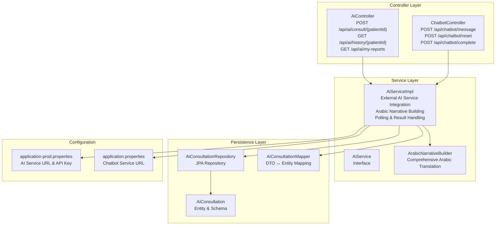
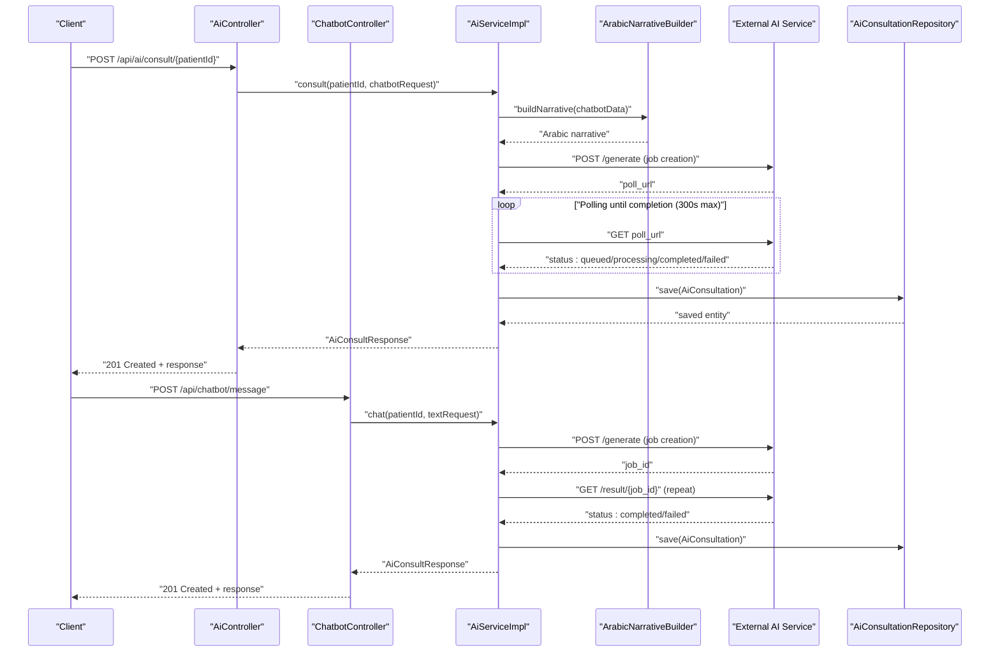
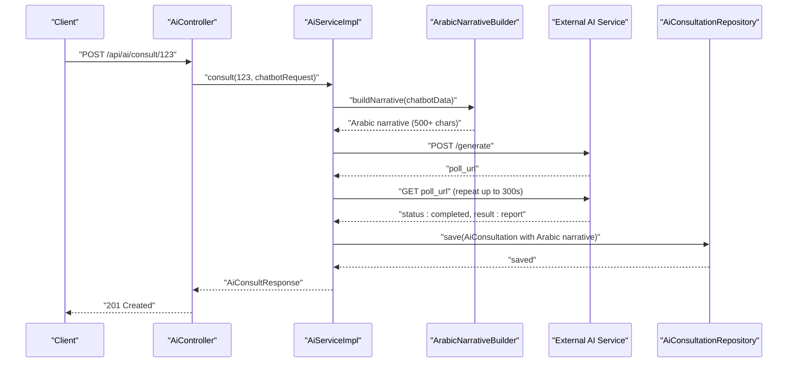
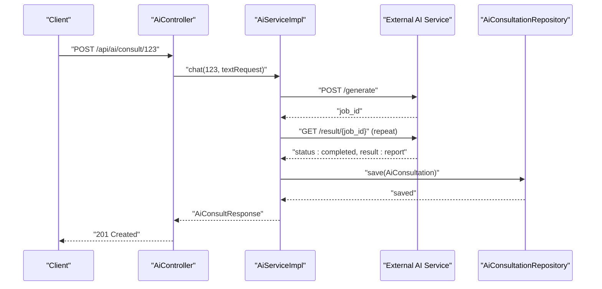
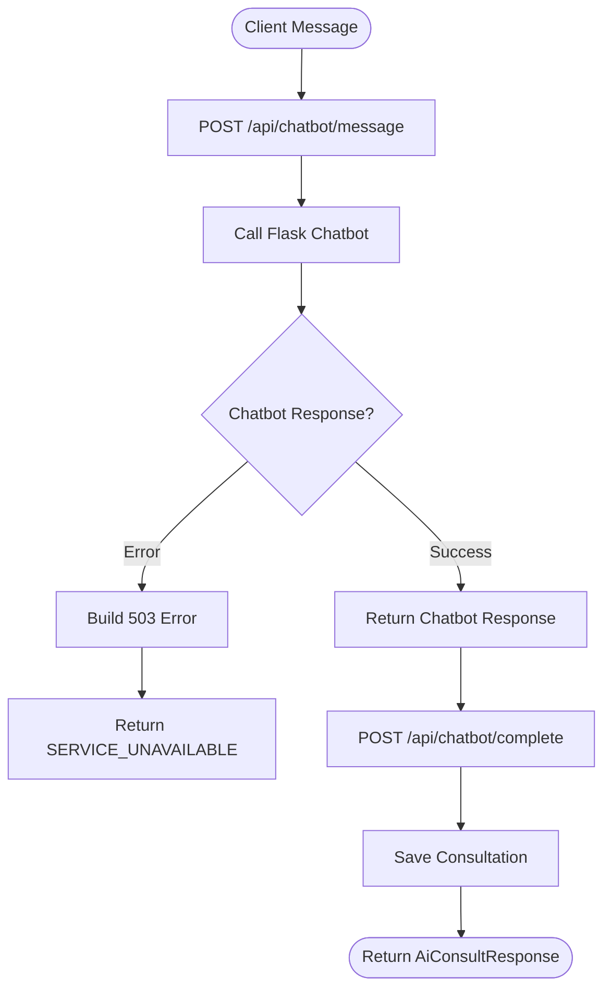
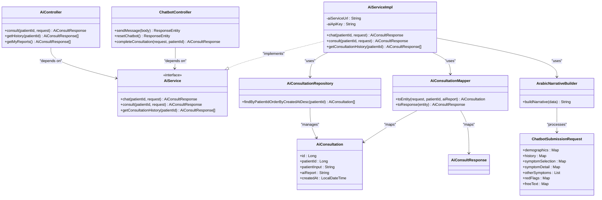

# AI Integration API

<cite>
**Referenced Files in This Document**
- [AiController.java](file://src/main/java/com/example/graduation_project/controller/AiController.java)
- [ChatbotController.java](file://src/main/java/com/example/graduation_project/controller/ChatbotController.java)
- [AiService.java](file://src/main/java/com/example/graduation_project/service/AiService.java)
- [AiServiceImpl.java](file://src/main/java/com/example/graduation_project/service/impl/AiServiceImpl.java)
- [ArabicNarrativeBuilder.java](file://src/main/java/com/example/graduation_project/service/ArabicNarrativeBuilder.java)
- [ChatbotSubmissionRequest.java](file://src/main/java/com/example/graduation_project/dto/ChatbotSubmissionRequest.java)
- [AiConsultation.java](file://src/main/java/com/example/graduation_project/entity/AiConsultation.java)
- [AiConsultationRepository.java](file://src/main/java/com/example/graduation_project/repository/AiConsultationRepository.java)
- [AiConsultationMapper.java](file://src/main/java/com/example/graduation_project/mapper/AiConsultationMapper.java)
- [AiConsultRequest.java](file://src/main/java/com/example/graduation_project/dto/AiConsultRequest.java)
- [AiConsultResponse.java](file://src/main/java/com/example/graduation_project/dto/AiConsultResponse.java)
- [application-prod.properties](file://src/main/resources/application-prod.properties)
- [application.properties](file://src/main/resources/application.properties)
- [ARCHITECTURE_REPORT.md](file://ARCHITECTURE_REPORT.md)
- [README.md](file://README.md)
- [recommendations_gewily.txt](file://Plan_and_implementations/recommendations_gewily.txt)
- [ai_chatbot_error_handling.md](file://missing_features/done_features/ai_chatbot_error_handling.md)
</cite>

## Update Summary
**Changes Made**
- Added new chatbot-driven consultation endpoint POST /api/ai/consult/{patientId}
- Added new patient report access endpoint GET /api/ai/my-reports
- Integrated comprehensive Arabic narrative building workflow
- Added ChatbotSubmissionRequest DTO for structured chatbot data
- Enhanced service layer with new consult() method for chatbot integration
- Updated architecture to support dual consultation flows (legacy and chatbot-driven)

## Table of Contents
1. [Introduction](#introduction)
2. [Project Structure](#project-structure)
3. [Core Components](#core-components)
4. [Architecture Overview](#architecture-overview)
5. [Detailed Component Analysis](#detailed-component-analysis)
6. [API Reference](#api-reference)
7. [External AI Service Integration](#external-ai-service-integration)
8. [Workflow Examples](#workflow-examples)
9. [Dependency Analysis](#dependency-analysis)
10. [Performance Considerations](#performance-considerations)
11. [Troubleshooting Guide](#troubleshooting-guide)
12. [Conclusion](#conclusion)

## Introduction
This document provides comprehensive API documentation for the AI-powered consultation system. The system now supports two distinct consultation workflows: traditional text-based consultations and advanced chatbot-driven consultations with comprehensive Arabic narrative building. It covers the AI consultation workflow, external service integration, error handling, and operational characteristics. The system enables authenticated patients and doctors to submit medical queries to an external AI service, tracks consultation status, retrieves historical consultations, and persists results in the database.

## Project Structure
The AI integration spans the controller, service, persistence, and DTO layers, with configuration for external AI service connectivity and chatbot integration.

**Diagram sources**
- [AiController.java:24-56](file://src/main/java/com/example/graduation_project/controller/AiController.java#L24-L56)
- [ChatbotController.java:29-129](file://src/main/java/com/example/graduation_project/controller/ChatbotController.java#L29-L129)
- [AiServiceImpl.java:34-339](file://src/main/java/com/example/graduation_project/service/impl/AiServiceImpl.java#L34-L339)
- [ArabicNarrativeBuilder.java:21-563](file://src/main/java/com/example/graduation_project/service/ArabicNarrativeBuilder.java#L21-L563)
- [AiConsultationRepository.java:10-14](file://src/main/java/com/example/graduation_project/repository/AiConsultationRepository.java#L10-L14)
- [AiConsultation.java:12-39](file://src/main/java/com/example/graduation_project/entity/AiConsultation.java#L12-L39)
- [AiConsultationMapper.java:9-20](file://src/main/java/com/example/graduation_project/mapper/AiConsultationMapper.java#L9-L20)
- [application-prod.properties:17-22](file://src/main/resources/application-prod.properties#L17-L22)
- [application.properties:24-25](file://src/main/resources/application.properties#L24-L25)

**Section sources**
- [AiController.java:1-57](file://src/main/java/com/example/graduation_project/controller/AiController.java#L1-L57)
- [ChatbotController.java:1-129](file://src/main/java/com/example/graduation_project/controller/ChatbotController.java#L1-L129)
- [AiServiceImpl.java:1-339](file://src/main/java/com/example/graduation_project/service/impl/AiServiceImpl.java#L1-L339)
- [ArabicNarrativeBuilder.java:1-563](file://src/main/java/com/example/graduation_project/service/ArabicNarrativeBuilder.java#L1-L563)
- [AiConsultationRepository.java:1-15](file://src/main/java/com/example/graduation_project/repository/AiConsultationRepository.java#L1-L15)
- [AiConsultation.java:1-40](file://src/main/java/com/example/graduation_project/entity/AiConsultation.java#L1-L40)
- [AiConsultationMapper.java:1-21](file://src/main/java/com/example/graduation_project/mapper/AiConsultationMapper.java#L1-L21)
- [application-prod.properties:1-35](file://src/main/resources/application-prod.properties#L1-L35)
- [application.properties:1-28](file://src/main/resources/application.properties#L1-L28)

## Core Components
- **Controller Layer**: Exposes endpoints for consultation submission, history retrieval, and chatbot integration.
- **Service Layer**: Orchestrates external AI service communication, Arabic narrative building, polling, persistence, and response mapping.
- **Persistence Layer**: Stores consultation records with patient input, AI report, and timestamps.
- **DTO Layer**: Defines request/response contracts for AI consultations and chatbot submissions.
- **Configuration Layer**: Manages external AI service URLs, API keys, and chatbot service connectivity.

Key responsibilities:
- Validate and process both legacy text-based and chatbot-driven consultation requests.
- Integrate with external AI service via HTTP with Arabic narrative translation.
- Poll for completion and handle timeouts/failures for both consultation types.
- Persist results and expose history to authorized users.
- Build comprehensive Arabic narratives from structured chatbot data.

**Section sources**
- [AiController.java:28-56](file://src/main/java/com/example/graduation_project/controller/AiController.java#L28-L56)
- [AiService.java:9-27](file://src/main/java/com/example/graduation_project/service/AiService.java#L9-L27)
- [AiServiceImpl.java:34-339](file://src/main/java/com/example/graduation_project/service/impl/AiServiceImpl.java#L34-L339)
- [ArabicNarrativeBuilder.java:21-563](file://src/main/java/com/example/graduation_project/service/ArabicNarrativeBuilder.java#L21-L563)
- [ChatbotSubmissionRequest.java:9-53](file://src/main/java/com/example/graduation_project/dto/ChatbotSubmissionRequest.java#L9-L53)

## Architecture Overview
The AI integration follows a dual-flow architecture: the backend forwards requests to an external AI service, builds Arabic narratives from chatbot data, polls for completion, and persists the result locally.

**Diagram sources**
- [AiController.java:33-40](file://src/main/java/com/example/graduation_project/controller/AiController.java#L33-L40)
- [ChatbotController.java:48-68](file://src/main/java/com/example/graduation_project/controller/ChatbotController.java#L48-L68)
- [AiServiceImpl.java:194-337](file://src/main/java/com/example/graduation_project/service/impl/AiServiceImpl.java#L194-L337)
- [ArabicNarrativeBuilder.java:266-561](file://src/main/java/com/example/graduation_project/service/ArabicNarrativeBuilder.java#L266-L561)
- [AiConsultationRepository.java:10-14](file://src/main/java/com/example/graduation_project/repository/AiConsultationRepository.java#L10-L14)

**Section sources**
- [ARCHITECTURE_REPORT.md:600-631](file://ARCHITECTURE_REPORT.md#L600-L631)
- [AiServiceImpl.java:35-44](file://src/main/java/com/example/graduation_project/service/impl/AiServiceImpl.java#L35-L44)

## Detailed Component Analysis

### Controller Layer
- **AiController**: Exposes:
  - POST /api/ai/consult/{patientId}: Submits a chatbot-driven consultation request for a patient using ChatbotSubmissionRequest.
  - GET /api/ai/history/{patientId}: Retrieves consultation history for a patient (doctor-only).
  - GET /api/ai/my-reports: Retrieves current user's consultation reports (patient-only).
- **ChatbotController**: Exposes:
  - POST /api/chatbot/message: Forwards messages to Flask chatbot service.
  - POST /api/chatbot/reset: Resets chatbot conversation state.
  - POST /api/chatbot/complete: Completes chatbot consultation and saves report.
- Uses method-level security to restrict access based on roles.

**Section sources**
- [AiController.java:28-56](file://src/main/java/com/example/graduation_project/controller/AiController.java#L28-L56)
- [ChatbotController.java:29-129](file://src/main/java/com/example/graduation_project/controller/ChatbotController.java#L29-L129)

### Service Layer
- **AiServiceImpl**: Implements:
  - **Legacy chat() method**: External AI service integration with HTTP headers and JSON payload for text-based consultations.
  - **New consult() method**: Processes chatbot submissions by building Arabic narratives, submitting to AI server, polling for completion, and persisting results.
  - Job submission and polling with configurable limits and intervals (300s max for chatbot flow).
  - Robust error handling for network failures, parsing errors, and timeouts.
  - Persists results and maps to DTO for response.
- **ArabicNarrativeBuilder**: Comprehensive service that converts structured chatbot JSON into continuous Arabic narrative strings with extensive translation mappings.

Key behaviors:
- Header configuration includes API key for external service access.
- Arabic narrative building uses extensive translation maps for symptoms, severity, duration, and medical conditions.
- Polling loop retries until completion or failure, with maximum attempts and interval.
- On success, saves consultation and returns mapped response.

**Section sources**
- [AiServiceImpl.java:35-44](file://src/main/java/com/example/graduation_project/service/impl/AiServiceImpl.java#L35-L44)
- [AiServiceImpl.java:194-337](file://src/main/java/com/example/graduation_project/service/impl/AiServiceImpl.java#L194-L337)
- [ArabicNarrativeBuilder.java:21-563](file://src/main/java/com/example/graduation_project/service/ArabicNarrativeBuilder.java#L21-L563)

### Persistence Layer
- **AiConsultation entity** stores:
  - Patient identifier, original input (Arabic narrative for chatbot submissions), AI-generated report, and creation timestamp.
  - Database indexes optimize queries by patient and creation time.
- **AiConsultationRepository** provides history retrieval ordered by creation time.
- **AiConsultationMapper** handles bidirectional mapping between DTO and entity.

**Section sources**
- [AiConsultation.java:12-39](file://src/main/java/com/example/graduation_project/entity/AiConsultation.java#L12-L39)
- [AiConsultationRepository.java:10-14](file://src/main/java/com/example/graduation_project/repository/AiConsultationRepository.java#L10-L14)
- [AiConsultationMapper.java:9-20](file://src/main/java/com/example/graduation_project/mapper/AiConsultationMapper.java#L9-L20)

### Data Transfer Objects
- **ChatbotSubmissionRequest**: Comprehensive DTO for chatbot-driven consultations with structured medical data including demographics, history, symptoms, and free text.
- **AiConsultRequest**: Legacy DTO for simple text-based consultations.
- **AiConsultResponse**: Encapsulates persisted consultation data for clients.

**Section sources**
- [ChatbotSubmissionRequest.java:9-53](file://src/main/java/com/example/graduation_project/dto/ChatbotSubmissionRequest.java#L9-L53)
- [AiConsultRequest.java:11-15](file://src/main/java/com/example/graduation_project/dto/AiConsultRequest.java#L11-L15)
- [AiConsultResponse.java:15-30](file://src/main/java/com/example/graduation_project/dto/AiConsultResponse.java#L15-L30)

## API Reference

### Authentication and Authorization
- **AiController endpoints**:
  - POST /api/ai/consult/{patientId}: Roles PATIENT or DOCTOR.
  - GET /api/ai/history/{patientId}: Role DOCTOR.
  - GET /api/ai/my-reports: Role PATIENT.
- **ChatbotController endpoints**:
  - POST /api/chatbot/message: Requires authentication.
  - POST /api/chatbot/reset: Requires authentication.
  - POST /api/chatbot/complete: Public endpoint (called by Flask service).

**Section sources**
- [AiController.java:33-55](file://src/main/java/com/example/graduation_project/controller/AiController.java#L33-L55)
- [ChatbotController.java:48-115](file://src/main/java/com/example/graduation_project/controller/ChatbotController.java#L48-L115)
- [README.md:164-174](file://README.md#L164-L174)

### POST /api/ai/consult/{patientId}
- **Purpose**: Submit a comprehensive chatbot-driven medical consultation request to the AI service.
- **Path Parameters**:
  - patientId (Long): Target patient identifier.
- **Request Body**: ChatbotSubmissionRequest
  - demographics: Map with age, sex, weight_kg, height_cm, pregnancy.
  - history: Map with known_cardiac, prior_workup, chronic_conditions, medications, med_adherence, family_history, lifestyle.
  - symptomSelection: Map with chosen symptom codes.
  - symptomDetail: Map of symptom details with severity, duration, pattern, triggers, relieving factors, and symptom-specific attributes.
  - otherSymptoms: List of additional symptoms with code and Arabic label.
  - redFlags: Map with exertional_chest, syncope_exertion.
  - freeText: Map with additional Arabic text.
- **Response**: AiConsultResponse
  - id (Long), patientId (Long), aiReport (string), createdAt (datetime).
- **Status Codes**:
  - 201 Created on successful processing and persistence.
  - 400 Bad Request for validation errors.
  - 401 Unauthorized for missing/invalid authentication.
  - 403 Forbidden for insufficient permissions.
  - 500 Internal Server Error for service failures.

**Notes**:
- The request triggers Arabic narrative building from structured chatbot data.
- The Arabic narrative is sent to external AI service for processing.
- The response contains the generated report and metadata.

**Section sources**
- [AiController.java:33-40](file://src/main/java/com/example/graduation_project/controller/AiController.java#L33-L40)
- [ChatbotSubmissionRequest.java:9-53](file://src/main/java/com/example/graduation_project/dto/ChatbotSubmissionRequest.java#L9-L53)
- [AiServiceImpl.java:194-337](file://src/main/java/com/example/graduation_project/service/impl/AiServiceImpl.java#L194-L337)

### GET /api/ai/my-reports
- **Purpose**: Retrieve consultation reports for the current authenticated patient.
- **Response**: Array of AiConsultResponse entries, ordered by creation time descending.
- **Status Codes**:
  - 200 OK with report list.
  - 401 Unauthorized for missing/invalid authentication.
  - 500 Internal Server Error for service failures.

**Section sources**
- [AiController.java:42-48](file://src/main/java/com/example/graduation_project/controller/AiController.java#L42-L48)
- [AiConsultationRepository.java:10-14](file://src/main/java/com/example/graduation_project/repository/AiConsultationRepository.java#L10-L14)

### GET /api/ai/history/{patientId}
- **Purpose**: Retrieve consultation history for a patient (doctor-only).
- **Path Parameters**:
  - patientId (Long): Target patient identifier.
- **Response**: Array of AiConsultResponse entries, ordered by creation time descending.
- **Status Codes**:
  - 200 OK with history list.
  - 401 Unauthorized for missing/invalid authentication.
  - 403 Forbidden for insufficient permissions.
  - 500 Internal Server Error for service failures.

**Section sources**
- [AiController.java:50-55](file://src/main/java/com/example/graduation_project/controller/AiController.java#L50-L55)
- [AiConsultationRepository.java:10-14](file://src/main/java/com/example/graduation_project/repository/AiConsultationRepository.java#L10-L14)

### POST /api/chatbot/message
- **Purpose**: Forward a message to the Flask chatbot service.
- **Request Body**: Map with "message" field.
- **Response**: Chatbot service response or structured 503 error.
- **Status Codes**:
  - 200 OK with chatbot response.
  - 503 Service Unavailable for chatbot service errors.

**Section sources**
- [ChatbotController.java:48-68](file://src/main/java/com/example/graduation_project/controller/ChatbotController.java#L48-L68)

### POST /api/chatbot/reset
- **Purpose**: Reset the Flask chatbot conversation state.
- **Response**: 200 OK on success or structured 503 error.
- **Status Codes**:
  - 200 OK on success.
  - 503 Service Unavailable for chatbot service errors.

**Section sources**
- [ChatbotController.java:76-95](file://src/main/java/com/example/graduation_project/controller/ChatbotController.java#L76-L95)

### POST /api/chatbot/complete
- **Purpose**: Complete a chatbot consultation and save the report.
- **Request Body**: AiConsultRequest with patient input.
- **Query Parameters**:
  - patientId (Long): Patient identifier.
- **Response**: AiConsultResponse with status 201.
- **Status Codes**:
  - 201 Created on successful processing.
  - 503 Service Unavailable for AI service errors.

**Section sources**
- [ChatbotController.java:105-115](file://src/main/java/com/example/graduation_project/controller/ChatbotController.java#L105-L115)

## External AI Service Integration
- **Base URL and API key** are configured via application properties.
- **Chatbot service URL** is configured separately for Flask integration.
- **Integration flow**:
  - Submit job to external AI service with Arabic narrative for chatbot submissions.
  - Poll for completion using job/poll URL.
  - Persist result upon completion.
- **Error handling**:
  - Network/client errors are caught and surfaced as user-friendly messages.
  - Parsing failures and timeouts trigger appropriate runtime exceptions.
  - Chatbot service errors return structured 503 responses.

Configuration highlights:
- ai.service.url: External AI service endpoint.
- ai.service.api-key: API key header for service access.
- chatbot.service.url: Flask chatbot service endpoint.

**Section sources**
- [AiServiceImpl.java:35-44](file://src/main/java/com/example/graduation_project/service/impl/AiServiceImpl.java#L35-L44)
- [application-prod.properties:17-22](file://src/main/resources/application-prod.properties#L17-L22)
- [application.properties:24-25](file://src/main/resources/application.properties#L24-L25)
- [ARCHITECTURE_REPORT.md:600-631](file://ARCHITECTURE_REPORT.md#L600-L631)

## Workflow Examples

### Example 1: Chatbot-Driven Consultation with Arabic Narrative

**Diagram sources**
- [AiController.java:33-40](file://src/main/java/com/example/graduation_project/controller/AiController.java#L33-L40)
- [AiServiceImpl.java:194-337](file://src/main/java/com/example/graduation_project/service/impl/AiServiceImpl.java#L194-L337)
- [ArabicNarrativeBuilder.java:266-561](file://src/main/java/com/example/graduation_project/service/ArabicNarrativeBuilder.java#L266-L561)
- [AiConsultationRepository.java:10-14](file://src/main/java/com/example/graduation_project/repository/AiConsultationRepository.java#L10-L14)

### Example 2: Legacy Text-Based Consultation

**Diagram sources**
- [AiController.java:33-40](file://src/main/java/com/example/graduation_project/controller/AiController.java#L33-L40)
- [AiServiceImpl.java:53-176](file://src/main/java/com/example/graduation_project/service/impl/AiServiceImpl.java#L53-L176)
- [AiConsultationRepository.java:10-14](file://src/main/java/com/example/graduation_project/repository/AiConsultationRepository.java#L10-L14)

### Example 3: Chatbot Service Integration Flow

**Diagram sources**
- [ChatbotController.java:48-115](file://src/main/java/com/example/graduation_project/controller/ChatbotController.java#L48-L115)

## Dependency Analysis

**Diagram sources**
- [AiController.java:28-56](file://src/main/java/com/example/graduation_project/controller/AiController.java#L28-L56)
- [ChatbotController.java:29-129](file://src/main/java/com/example/graduation_project/controller/ChatbotController.java#L29-L129)
- [AiService.java:9-27](file://src/main/java/com/example/graduation_project/service/AiService.java#L9-L27)
- [AiServiceImpl.java:34-339](file://src/main/java/com/example/graduation_project/service/impl/AiServiceImpl.java#L34-L339)
- [ArabicNarrativeBuilder.java:21-563](file://src/main/java/com/example/graduation_project/service/ArabicNarrativeBuilder.java#L21-L563)
- [AiConsultationRepository.java:10-14](file://src/main/java/com/example/graduation_project/repository/AiConsultationRepository.java#L10-L14)
- [AiConsultation.java:12-39](file://src/main/java/com/example/graduation_project/entity/AiConsultation.java#L12-L39)
- [AiConsultationMapper.java:9-20](file://src/main/java/com/example/graduation_project/mapper/AiConsultationMapper.java#L9-L20)
- [ChatbotSubmissionRequest.java:9-53](file://src/main/java/com/example/graduation_project/dto/ChatbotSubmissionRequest.java#L9-L53)

**Section sources**
- [AiController.java:28-56](file://src/main/java/com/example/graduation_project/controller/AiController.java#L28-L56)
- [ChatbotController.java:29-129](file://src/main/java/com/example/graduation_project/controller/ChatbotController.java#L29-L129)
- [AiServiceImpl.java:34-339](file://src/main/java/com/example/graduation_project/service/impl/AiServiceImpl.java#L34-L339)
- [AiConsultationRepository.java:10-14](file://src/main/java/com/example/graduation_project/repository/AiConsultationRepository.java#L10-L14)

## Performance Considerations
- **Polling strategy**: Different intervals for legacy (3s) vs chatbot (2s) flows with different maximum wait times (300s for chatbot).
- **Network overhead**: External service latency and retry behavior impact perceived performance.
- **Database writes**: Each successful consultation triggers a persistence operation; ensure adequate indexing for history queries.
- **Arabic narrative processing**: Comprehensive translation mappings add processing overhead but ensure accurate medical terminology.
- **Concurrency**: Multiple concurrent consultations per patient are supported by the design.
- **Chatbot service**: Separate Flask service requires proper load balancing and monitoring.

## Troubleshooting Guide
Common issues and resolutions:
- **External service unavailable**:
  - Symptoms: Runtime exceptions indicating temporary unavailability.
  - Resolution: Retry after service stabilization; verify AI service URL and API key.
- **Chatbot service errors**:
  - Symptoms: 503 Service Unavailable responses from chatbot endpoints.
  - Resolution: Check Flask service health and connectivity; verify chatbot.service.url configuration.
- **Timeout during polling**:
  - Symptoms: Timeout error after maximum attempts (300s for chatbot).
  - Resolution: Verify external service health and job processing capacity.
- **Missing job_id or result fields**:
  - Symptoms: Parsing errors leading to unavailability messages.
  - Resolution: Check external service response format and network connectivity.
- **Access denied**:
  - Symptoms: 403 Forbidden for insufficient roles.
  - Resolution: Ensure caller has required role (PATIENT/DOCTOR for consult; DOCTOR for history).
- **Arabic narrative building failures**:
  - Symptoms: Empty or incomplete Arabic reports.
  - Resolution: Verify chatbot submission data structure and translation mappings.

**Section sources**
- [AiServiceImpl.java:78-100](file://src/main/java/com/example/graduation_project/service/impl/AiServiceImpl.java#L78-L100)
- [AiServiceImpl.java:145-148](file://src/main/java/com/example/graduation_project/service/impl/AiServiceImpl.java#L145-L148)
- [AiServiceImpl.java:129-134](file://src/main/java/com/example/graduation_project/service/impl/AiServiceImpl.java#L129-L134)
- [ChatbotController.java:58-67](file://src/main/java/com/example/graduation_project/controller/ChatbotController.java#L58-L67)

## Conclusion
The AI Integration API now provides a comprehensive foundation for processing medical consultations through an external AI service, supporting both traditional text-based and advanced chatbot-driven workflows with Arabic narrative building. The system includes robust error handling, dual consultation flows, and integrated chatbot service connectivity. The documented endpoints enable authenticated users to submit complex medical queries, track outcomes, retrieve historical records, and access their own reports. Future enhancements could include explicit status and cancellation endpoints to complement the existing polling-based workflow, and additional Arabic translation coverage for expanded medical terminology.