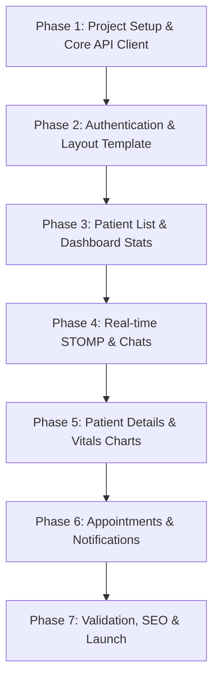

# WEB_IMPLEMENTATION_PLAN.md — Web Rebuild Implementation Plan

This document outlines the step-by-step implementation plan for rebuilding the NABDA mobile application's doctor-facing features into a premium, responsive web application.

---

## 1. Technology Stack Recommendation

To deliver a premium, highly responsive web application that matches the rich visual aesthetic and complex real-time needs of the NABDA doctor portal, we recommend:

| Layer | Technology | Rationale |
|---|---|---|
| **Core Framework** | **React / Next.js (App Router)** | industry standard for SPAs, optimized performance, server-side routing, and static generation. |
| **Language** | **TypeScript** | Strict typing using the interfaces defined in `DATA_MODELS.md` guarantees API client safety. |
| **State Management** | **Zustand** | Lightweight, fast, store-based state management for active session data, patient list, and chats. |
| **HTTP Client** | **Axios** | Robust interceptor support for automatic token refresh (as detailed in `BUSINESS_LOGIC.md`). |
| **Real-Time Communications** | **@stomp/stompjs + SockJS-client** | Web-compatible implementations matching the Spring Boot STOMP protocol. |
| **Charts** | **Recharts / ApexCharts** | Premium, interactive, and customizable SVG/HTML5 charts for vitals visualization. |
| **Styling** | **Vanilla CSS + CSS Modules** | Clean CSS system with variables for design tokens to create rich animations and glassmorphism. |
| **Markdown Rendering** | **react-markdown** | To render AI assessment reports natively in the web UI. |

---

## 2. Phase-by-Phase Roadmap



### Phase 1: Setup & Core Infrastructure (Target: Days 1-2)
- [ ] Initialize Next.js project with TypeScript: `npx create-next-app@latest ./`
- [ ] Establish directory structure:
  ```
  /src
    /components      # Reusable UI widgets
    /context         # Context providers (e.g. AuthContext)
    /hooks           # Custom hooks (e.g. useWebSocket, usePresence)
    /services        # API services (apiClient, chatService, etc.)
    /store           # Global stores (Zustand)
    /types           # TypeScript interfaces (from DATA_MODELS.md)
    /styles          # Global tokens and styling system
  ```
- [ ] Configure global styling tokens (`/styles/globals.css`):
  - Curated premium dark-blue and teal gradients.
  - Color palettes matching mobile app status styles (`CRITICAL`, `WARNING`, `NORMAL`, `UNKNOWN`).
  - Fluid typography scale.
- [ ] Implement `apiClient.ts` with Axios:
  - Configure `BASE_URL` to point to the Elastic Beanstalk backend.
  - Implement request interceptor to inject `Authorization: Bearer <JWT>`.
  - Implement response interceptor for **401/403 auto-token-refresh** using stored credentials.
  - Implement force-logout safety guard.

### Phase 2: Authentication & Shell Design (Target: Days 3-4)
- [ ] Implement custom hooks / state for Auth (`sessionStorage` for login credentials, `localStorage` for JWT).
- [ ] Build **Login Page (`/login`)**:
  - Email/password validation.
  - Enforce doctor-only role check after profile load.
  - Clean error display states.
- [ ] Build **Register Page (`/register`)**:
  - Hardcode `role: "DOCTOR"`.
  - Form validation with reactive alerts.
- [ ] Design **Main Dashboard Shell Layout**:
  - Persistent left sidebar (collapsible for mobile, expanded for desktop navigation).
  - Top header displaying active doctor avatar (supporting Base64), search shortcut, and notification bell.
  - Sidebar routing integration with Next.js router.

### Phase 3: Dashboard Overview & Patient Management (Target: Days 5-7)
- [ ] Build **Dashboard Overview (`/dashboard`)**:
  - Premium Stat Cards grid (Total Patients, Need Attention count, Pending Messages count, Today's Appointments, Missed Appointments).
  - Red Critical Alerts banner if `criticalCount > 0`.
  - Recent Patients widget (top 3 cards showing live heartbeat).
- [ ] Build **Patients List (`/patients`)**:
  - Desktop-optimized grid / table displaying patient cards.
  - Local fuzzy-search by patient name.
  - "Assign Patient" action modal:
    - Debounced name / phone lookup calls (`GET /doctor/search/*`).
    - link assign triggers `POST /doctor/assign`.
    - Silent list re-syncing.
  - Remove patient action with confirm modal (`DELETE /doctor/remove`).

### Phase 4: Live Connections & Messaging (Target: Days 8-10)
- [ ] Build STOMP WebSocket connection manager (`useWebSocket.ts`):
  - Connect with JWT headers.
  - Subscriptions: `/user/queue/messages`, `/user/queue/chat-status`, `/user/queue/system`.
  - Auto-reconnect handling (5-second delay).
  - Dispatch global Zustand state updates.
- [ ] Build **Conversations List (`/chats`)**:
  - Left-hand master panel showing patients with active histories.
  - Presence polling hook (runs every 15s to fetch online/offline/last-seen tags).
  - Unread badge counters.
- [ ] Build **Active Chat Panel (`/chats/[patientId]`)**:
  - Scrolling message timeline with visual read/delivered receipts.
  - Local auto-marking as delivered/read via PUT endpoints on mount.
  - Send message bar calling WebSocket destination `/app/chat.send`.

### Phase 5: Vitals Charting & AI Reports (Target: Days 11-13)
- [ ] Build **Patient Details Page (`/patients/[id]`)**:
  - Vitals metrics display widgets (HR, SpO2, Battery Level).
  - WebSocket subscription integration to `/topic/vitals/{doctorId}` to render blinking pulse animations and live numbers.
  - Patient demographics overview (age calculated from DOB, height, weight).
- [ ] Build **Vitals History Charts (`/patients/[id]/vitals`)**:
  - Clean graph canvas with metrics toggle (Heart Rate, SpO2, or overlay both).
  - Time range selector requesting REST summaries (24H hourly, 7D daily, 30D daily).
- [ ] Build **AI Reports Viewer (`/patients/[id]/reports`)**:
  - Left timeline with dates of reports.
  - Right viewport displaying selected report rendered via markdown processor.

### Phase 6: Appointments & Notifications (Target: Days 14-15)
- [ ] Build **Appointments (`/appointments`)**:
  - Filterable calendar views / lists (Today, Missed, Upcoming, Confirmed, Completed, Cancelled).
  - Action buttons triggering optimistic state changes with backend PATCH confirmation.
  - Schedule Appointment modal on Patient Detail (`POST /appointments/schedule`).
- [ ] Build **Notification Center (`/notifications`)**:
  - Paginated list loading (20 entries at a time) with infinite scroll hook.
  - Individual/bulk read updates and delete requests.
- [ ] Build **Doctor Profile Settings (`/profile`, `/settings`)**:
  - Avatar image converter (Base64 file reader).
  - Form edits syncing with `PUT /user/me`.
  - Local settings persistence (language, system theme).

---

## 3. Web Layout Design Guidelines

To guarantee the web rebuild delivers a premium experience that exceeds a basic mobile port, we mandate the following design choices:

### Desktop Optimization: The Master-Detail Pattern
- Reorganize mobile pages into responsive split view layouts:
  - **Chats**: Keep the conversation directory pinned to the left, while the chat window occupies the wider right pane. Do not force the doctor to go backward to view another patient.
  - **AI Reports**: Maintain list timeline on the left, full markdown display on the right.
  - **Patient Details**: Group medical dashboard layout (live dials, bio cards, upcoming calendar items) visible on one screen without heavy scrolling.

### Premium Aesthetic Touches
- **Vibrant Sleek Dark Mode**: Use custom HSL tones (`hsl(222, 47%, 11%)` background, `hsl(217, 33%, 17%)` cards) rather than flat black.
- **Glassmorphism**: Backdrop blur headers (`backdrop-filter: blur(12px)`) on scrolls.
- **Micro-Animations**:
  - Patient cards should subtly expand (`transform: scale(1.02)`) on hover.
  - The live heart rate metric card should have an SVG heart icon pulse in sync with the live data arrival.
  - Status badges should have a breathing glow animation for critical patients.

---

## 4. Key Implementation Risks & Mitigations

### 1. The Google Sign-In "zombie" state
- **Risk**: Google OAuth flows on the web operate differently than Firebase Auth on Android/iOS. Firebase Auth isn't strictly necessary on the web app since the backend handles authentication directly, but Google user credentials are tied to their Firebase UID.
- **Mitigation**: Request clarification on Google Sign-In backend implementation. Ensure that the web OAuth credentials can resolve to a corresponding token on the backend, or isolate web sign-in to Email/Password first while confirming backend support for federated web credentials.

### 2. High AI Assessment Response Latency
- **Risk**: The AI consult endpoint (`POST /ai/consult/{patientId}`) has a receive timeout of 6 minutes on mobile. Long-running REST calls on the web can easily time out via browser limits or middle proxies.
- **Mitigation**: Implement a dedicated client-side timer overlay with progress visualizers. If a gateway timeout occurs, ensure the client can query report history (`GET /ai/history/{patientId}`) to check if the report eventually compiled.

### 3. WebSocket Connection Stability
- **Risk**: Stale sessions, page tabs running in the background, or weak connections will terminate WebSockets, breaking live heart rates and chat updates.
- **Mitigation**: Use `@stomp/stompjs` with an active heartbeat config (e.g. 10s incoming/outgoing heartbeat) and auto-reconnect configurations. Show a clean visual tag in the header indicating WebSocket status (Online/Syncing/Disconnected).

---

## 5. Verification & Testing Strategy

To verify the web app meets all criteria without regression:

### Automated Testing
- Set up **Jest + React Testing Library** for component render checks.
- Set up **Playwright / Cypress** to test critical workflows:
  - Login → Check token storage → Confirm redirect logic.
  - Patient List → Assign patient → Confirm WebSocket update triggers.
  - Active Chat → Send message → Verify STOMP queue delivery.

### Manual Verification Checklist
- Run connection testing:
  - Simulate server outage → verify "Server Down" blocks navigation.
  - Disconnect internet → verify "No Internet" screen displays.
- Cross-browser testing: Verify responsive breakpoints on Safari, Chrome, Edge, and mobile viewport simulations.
- Local storage leak audit: Verify that on Logout, all credentials and JWT tokens are completely cleared from both `localStorage` and `sessionStorage`.
